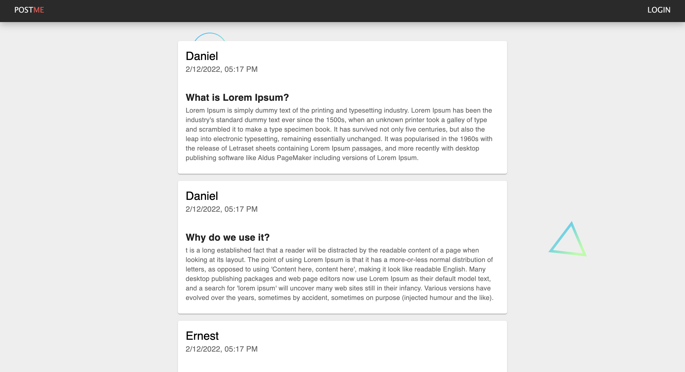

# Blog Post Social Media #

As a part of full stack web bootcamp, we requested to build a MERN project.
So I decided to build my first social blog post web.
For now, this web has only users with full authentication, post option for the users,
and a comment section to the posts (of course with full crud options).

### Technologies used:
* MongoDb
* Express
* React
* NodeJs
* Jwt
* Password hash
* MUI styling

## Setup ##
To start the app: 
1. Clone the repository
2. npm install
3. cd client npm i
4. npm run dev

#### Upcoming
* Pictures upload
* Chat with other users.
* Socket Io
* Different style

